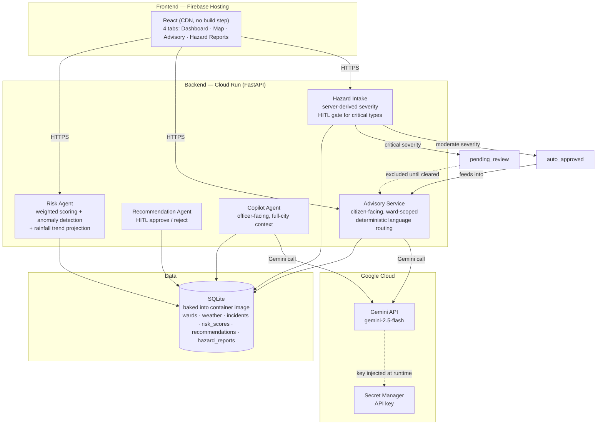
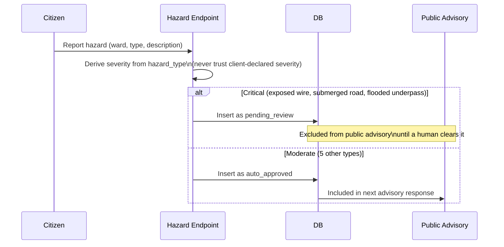

# APAC City Resilience Copilot

**Flood-risk decision intelligence for Karachi and Manila — built for the Google Gen AI Academy, APAC Edition, Cohort 2 (Track 1: AI-Powered Decision Intelligence Platform)**

🔗 **Live App**: https://resilience-copilot.web.app
🔗 **Live API**: https://resilience-copilot-backend-804820919576.asia-south1.run.app
👤 **Builder**: Fariha Imran — solo, Karachi-based, self-taught AI Developer & Builder

---

## Why this exists

> Pichle saal main khud is exact problem mein phas gayi thi — ek route pe gayi jahan gaadi paani mein doob gayi, kisi ne warn nahi kiya. Authorities ke pass ward-level data hota hai, lekin road-level real-time hazard sirf woh log jaante hain jo wahan se guzre. Yeh feature woh gap fill karta hai — community warns community, verified through crowd-consensus, delivered in the user's own language.

Flood warnings usually fail for two reasons: forecasts speak in probabilities ("likely," "moderate risk") that ordinary people don't act on, and the last-mile hazard — an open manhole, a live wire in floodwater — never reaches the people about to walk into it. This project converts ward-level flood-risk data into plain-language, localized, actionable guidance, and lets residents warn each other about hazards a satellite or sensor will never see.

---

## What it does

| Capability | Description |
|---|---|
| **Ward Risk Dashboard** | Live flood-risk scores, anomaly detection, and 3-day trend projection across **18 wards — 14 in Karachi, 4 in Manila** |
| **Satellite Risk Map** | Ward-level risk overlaid on real satellite basemap imagery |
| **Public Advisory Copilot** | Gemini-powered assistant that turns raw risk data into a plain-language advisory — automatically in the language the citizen asked in |
| **Community Hazard Reporting** | Residents report road-level hazards (open manholes, exposed wires, submerged roads); severity is never self-declared — it's derived server-side and life-threatening hazards are held for human review before they reach the public |

**Proof point**: the same scoring and advisory pipeline runs unmodified across two countries (Pakistan and the Philippines) — the architecture is city-agnostic by design, not hardcoded to Karachi.

---

## Measurable value

- **18 wards, 2 cities monitored** with zero code changes between them — demonstrates the platform scales across APAC without per-city engineering
- **5 of 8 hazard types auto-resolve instantly** (moderate severity), while the **3 life-threatening types** (exposed wiring, submerged roads, flooded underpasses) are automatically routed to human review — cutting manual triage load while keeping a human in the loop exactly where it matters
- **3-day predictive lead time** on flood risk per ward, computed from a live linear regression over rainfall history — not just a snapshot of current conditions
- **Deterministic language routing** on the public advisory endpoint — the citizen gets a reply in the language they asked in (English or Urdu, written in proper Nastaliq script, never Roman Urdu), decided in code rather than left to the model to guess

---

## Architecture



**Human-in-the-loop flow for hazard reports**:



---

## Security & trust-boundary decisions

This project treats trust boundaries as a design constraint, not an afterthought:

- **Severity is never client-supplied.** A `HAZARD_SEVERITY_MAP` on the server is the single source of truth for which hazard types are life-threatening. Letting a reporter self-declare severity would let a malicious or careless submission mark a live wire as "low" and skip human review entirely.
- **HITL gate on critical hazards.** Exposed wiring, submerged roads, and flooded underpasses are held as `pending_review` and excluded from the public advisory's context until a human clears them. Moderate hazards (potholes, fallen branches, etc.) auto-approve.
- **Prompt injection defense.** User-submitted hazard descriptions are wrapped in explicit `<DATA>` delimiters in the Gemini system prompt and labeled as data, not instructions — the model is told not to treat anything inside as a command.
- **Deterministic language routing.** Early versions relied on asking Gemini to detect the query's language and match it — this was inconsistent under testing (English questions sometimes returned Roman Urdu). The fix moved language detection into code (Unicode range check for Urdu script) so the response language is guaranteed rather than requested.
- **Input length caps.** Public queries and hazard descriptions are capped server-side (500 / 300 characters) to bound the cost and blast radius of any single request against the LLM.
- **Secrets never hardcoded.** The Gemini API key lives in Google Secret Manager and is injected into the container at runtime — it is not in the repo, not in an environment file that gets committed, and not visible in logs.
- **Known, documented gap:** CORS is currently `allow_origins=["*"]` to keep the hackathon demo simple with no auth wall. This is a real trust-boundary gap for a production deployment and is called out here deliberately rather than left silent — the fix is to lock it to the Firebase Hosting origin once the app has a fixed audience.

---

## Google Cloud ecosystem usage

| Service | Role |
|---|---|
| **Cloud Run** | Hosts the FastAPI backend; `--min-instances=1` keeps one instance warm so in-session writes (hazard reports, new risk scores) aren't lost to a cold start during a live demo |
| **Artifact Registry** | Container images built and stored automatically as part of `gcloud run deploy --source .` |
| **Cloud Build** | Builds the container from source on every deploy |
| **Secret Manager** | Stores the Gemini API key; injected into the container via `--set-secrets`, never hardcoded |
| **Cloud Logging** | Captures backend stdout/stderr automatically for observability |
| **IAM** | Least-privilege roles granted incrementally to the deploy service account (storage, logging, Artifact Registry, Secret Manager access) |
| **Firebase Hosting** | Serves the static frontend at the public app URL |
| **Gemini API** (`gemini-2.5-flash`) | Powers both the officer-facing Copilot and the citizen-facing public advisory |

**Evaluated and consciously not used**: Google Maps Platform was considered for the risk map, but Esri World Imagery (free, no API key, already tested and working) was kept for the hackathon timeline. Switching to Maps Platform is a planned production upgrade, not a gap in capability.

---

## Known limitations

Documented honestly rather than hidden:

- **Ephemeral writes on Cloud Run.** SQLite lives inside the container filesystem, which is wiped on a cold start. Read data (wards, seeded history) is baked into the image and safe; runtime writes (new hazard reports, new risk-score rows) are mitigated with `--min-instances=1` so the same instance persists through a demo session, but this is not a substitute for a managed database in production.
- **No "list all hazard reports" endpoint yet.** The Hazard Reports tab shows only the current browser session's submissions and resets on refresh.
- **No rate limiting on advisory endpoints yet.** Input length caps bound the cost per request, but there's no throttle on request frequency.
- **`flooded_underpass` is assumed critical** alongside exposed wiring and submerged roads — a reasonable default given Karachi's underpass flooding history, but not yet reconfirmed against local incident data.
- **CORS is open (`*`)** for the hackathon demo — see Security section above.

---

## Setup

```bash
git clone https://github.com/fariha548/apac-city-resilience-copilot.git
cd apac-city-resilience-copilot

python -m venv venv
venv\Scripts\Activate.ps1        # Windows PowerShell
pip install -r requirements.txt

cp .env.example .env             # add your own GEMINI_API_KEY

uvicorn main:app --reload        # runs at http://127.0.0.1:8000
```

The seeded SQLite database (`app/db/resilience.db`) ships with the repo — no migration step is needed to get real data on first run.

To deploy your own copy to Cloud Run, see the included `Dockerfile`; the project uses `gcloud run deploy --source .` with the Gemini key supplied via Secret Manager rather than an environment file.

---

## API endpoints

| Method | Path | Purpose |
|---|---|---|
| `GET` | `/health` | Liveness check |
| `GET` | `/risk-dashboard` | Latest risk score + trend for every ward |
| `GET` | `/ward/{ward_id}` | Full detail for one ward: profile, risk, recommendations |
| `POST` | `/recommendation/{rec_id}/approve` | HITL: approve a pending recommendation |
| `POST` | `/recommendation/{rec_id}/reject` | HITL: reject a pending recommendation |
| `POST` | `/advisory/public` | Citizen-facing Gemini advisory for one ward, language-matched |
| `POST` | `/advisory/hazard-report` | Submit a community hazard report; severity derived server-side |

---

## Stack

FastAPI · SQLite · Gemini API (`gemini-2.5-flash`, via `google-genai`) · Google Cloud Run · Firebase Hosting · Secret Manager · Leaflet + Esri World Imagery · React (CDN, no build step)

---

## Roadmap

- Manual language toggle in the UI, in addition to the current automatic detection
- Additional APAC languages (starting with Tagalog) as more cities are added
- Managed database (Cloud SQL) to remove the ephemeral-write limitation
- Rate limiting on public-facing endpoints
- Google Maps Platform integration for the risk map
