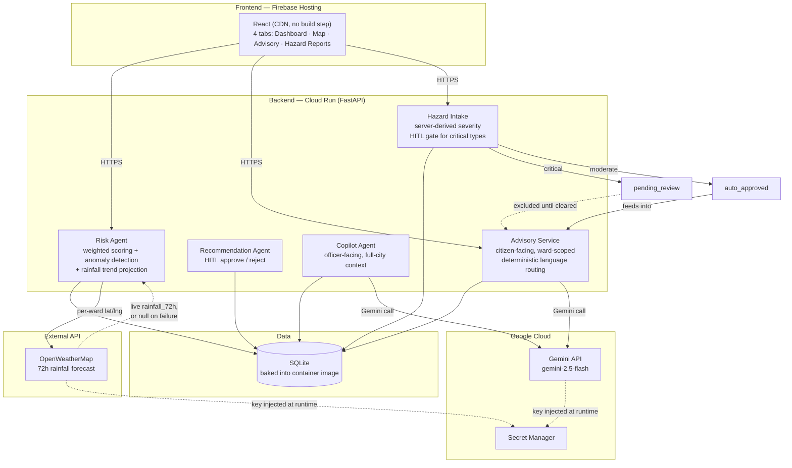
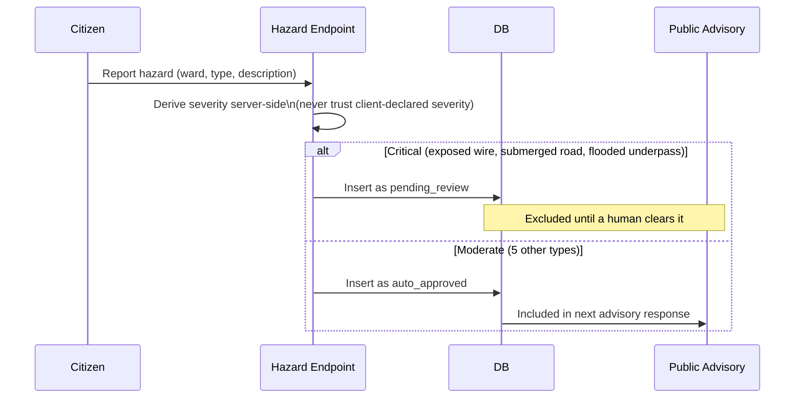

# 🌊 APAC City Resilience Copilot

### Flood-Risk Decision Intelligence for Karachi & Manila

**Google Gen AI Academy — APAC Edition, Cohort 2 (Track 1: AI-Powered Decision Intelligence Platform)**

[](LICENSE)
[](https://www.python.org/)
[](https://ai.google.dev/)
[](https://cloud.google.com/run)
[](https://firebase.google.com/)
[](https://cloud.google.com/secret-manager)
[](https://openweathermap.org/)

---

## 🌐 Live Demo

| Service | URL |
|---|---|
| **Web App** | https://resilience-copilot.web.app |
| **API Root** | https://resilience-copilot-backend-804820919576.asia-south1.run.app |
| **Health Check** | https://resilience-copilot-backend-804820919576.asia-south1.run.app/health |
| **Risk Dashboard API** | https://resilience-copilot-backend-804820919576.asia-south1.run.app/risk-dashboard |

---

## 🚨 Why This Exists

> Pichle saal main khud is exact problem mein phas gayi thi — ek route pe gayi jahan gaadi paani mein doob gayi, kisi ne warn nahi kiya. Authorities ke pass ward-level data hota hai, lekin road-level real-time hazard sirf woh log jaante hain jo wahan se guzre. Yeh feature woh gap fill karta hai — community warns community, verified through crowd-consensus, delivered in the user's own language.

Flood warnings usually fail for two reasons: forecasts speak in probabilities ("likely," "moderate risk") that ordinary people don't act on, and the last-mile hazard — an open manhole, a live wire in floodwater — never reaches the people about to walk into it. This project converts ward-level flood-risk data into plain-language, localized, actionable guidance, and lets residents warn each other about hazards a satellite or sensor will never see.

---

## 💡 What It Does

| Capability | Description |
|---|---|
| 📊 **Ward Risk Dashboard** | Live flood-risk scores, anomaly detection, and 3-day trend projection across **18 wards — 14 in Karachi, 4 in Manila**, with live 72-hour rainfall forecast (OpenWeatherMap) feeding directly into the trend model |
| 🛰️ **Satellite Risk Map** | Ward-level risk overlaid on satellite basemap imagery |
| 🗣️ **Public Advisory Copilot** | Gemini-powered assistant that turns raw risk data into plain-language guidance — automatically in the language the citizen asked in |
| ⚠️ **Community Hazard Reporting** | Residents report road-level hazards; severity is never self-declared — derived server-side, with life-threatening reports held for human review before reaching the public |

**Proof point**: the same scoring and advisory pipeline runs unmodified across two countries — the architecture is city-agnostic by design, not hardcoded to Karachi.

---

## ✅ Live & Verified — Tested End-to-End

| Feature | Status | Verified Behavior |
|---|---|---|
| Risk Dashboard | ✅ Live | 18 wards scored, gauge/KPI update on ward selection |
| Trend Projection | ✅ Live | `trend_direction` computed as delta between current score and 3-day projection — fixed a real inconsistency bug pre-submission |
| Live Weather Feed | ✅ Live | OpenWeatherMap 72h rainfall forecast fetched per ward on each risk computation; falls back to seeded forecast (never zero) if the API call fails |
| Satellite Map | ✅ Live | Karachi + Manila markers render on Esri World Imagery |
| Public Advisory (English) | ✅ Live | English query → full English response |
| Public Advisory (Urdu) | ✅ Live | Urdu-script query → full Urdu **Nastaliq script** response, deterministic code-level routing (not left to model self-detection) |
| Hazard Reporting — Critical | ✅ Live | `exposed_electric_wire` → `pending_review`, dynamic warning banner shown pre-submit |
| Hazard Reporting — Moderate | ✅ Live | `open_manhole` → `auto_approved` instantly |

---

## 📈 Measurable Value

- **18 wards, 2 cities monitored** with zero code changes between them — proves APAC scalability without per-city engineering
- **5 of 8 hazard types auto-resolve instantly** (moderate severity); the **3 life-threatening types** are automatically routed to human review — cutting manual triage load while keeping a human in the loop exactly where it matters
- **3-day predictive lead time** on flood risk per ward, from a live linear regression over rainfall history, now grounded in live 72-hour rainfall forecasts rather than seeded data alone
- **Deterministic language routing** — code-level detection guarantees response language, rather than hoping the model infers it correctly

---

## 🏗️ System Architecture



**Human-in-the-loop flow:**



---

## 🔒 Security & Trust-Boundary Decisions

- **Severity is never client-supplied.** A server-side `HAZARD_SEVERITY_MAP` is the single source of truth — letting a reporter self-declare severity would let a malicious submission mark a live wire as "low" and skip human review.
- **HITL gate on critical hazards.** Exposed wiring, submerged roads, and flooded underpasses stay `pending_review` and excluded from the public advisory until a human clears them.
- **Prompt injection defense.** User-submitted hazard descriptions are wrapped in explicit `<DATA>` delimiters, labeled as data, not instructions.
- **Deterministic language routing.** Early versions asked Gemini to self-detect query language — inconsistent under testing (English questions returned Roman Urdu). Fixed by moving detection into code (Unicode range check), guaranteeing response language instead of requesting it.
- **Fail-safe on external weather dependency.** `fetch_live_rainfall_72h()` returns `None` (never `0.0`) on any API failure or timeout, so a dead third-party API can't silently zero out a ward's rainfall input and understate flood risk — the system falls back to seeded forecast data instead.
- **Input length caps.** Queries and hazard descriptions capped server-side (500 / 300 characters) to bound cost and blast radius per request.
- **Secrets never hardcoded.** Gemini API key and OpenWeatherMap API key both live in Secret Manager, injected at runtime — never in the repo or committed env files.
- **Known, documented gap:** CORS is `allow_origins=["*"]` for the hackathon demo — called out deliberately rather than hidden. Production fix: lock to the Firebase Hosting origin.

---

## 🛠️ Google Cloud Ecosystem

| Service | Role |
|---|---|
| **Cloud Run** | Hosts the FastAPI backend; `--min-instances=1` keeps one instance warm so in-session writes survive a live demo |
| **Artifact Registry** | Container images built and stored automatically on every deploy |
| **Cloud Build** | Builds the container from source |
| **Secret Manager** | Stores the Gemini API key and OpenWeatherMap API key; both injected via `--set-secrets` |
| **Cloud Logging** | Captures backend stdout/stderr automatically |
| **IAM** | Least-privilege roles granted incrementally to the deploy service account |
| **Firebase Hosting** | Serves the static frontend |
| **Gemini API** (`gemini-2.5-flash`) | Powers the officer Copilot and citizen-facing advisory |

**External data**: OpenWeatherMap (72h rainfall forecast) — API key stored via Secret Manager, same pattern as the Gemini key.

**Evaluated, consciously not used**: Google Maps Platform was considered for the risk map; Esri World Imagery (free, no API key, already tested) was kept for the hackathon timeline. Maps Platform is a planned production upgrade, not a capability gap.

---

## ⚠️ Known Limitations

- **Ephemeral writes on Cloud Run** — SQLite lives inside the container filesystem, wiped on cold start. Seeded read data is baked into the image and safe; runtime writes are mitigated with `--min-instances=1`, not a substitute for a managed database in production.
- **Live weather dependency has an 8-second timeout** — under sustained OpenWeatherMap latency or an outage, all wards silently fall back to seeded forecast data rather than failing the request.
- **No "list all hazard reports" endpoint yet** — Hazard Reports tab shows only the current session's submissions.
- **No rate limiting on advisory endpoints yet** — input caps bound cost per request, but not request frequency.
- **`flooded_underpass` assumed critical** alongside exposed wiring and submerged roads — reasonable default, not yet reconfirmed against local incident data.
- **CORS is open (`*`)** for the hackathon demo — see Security section.

---

## 🚀 Quick Start

```bash
git clone https://github.com/fariha548/apac-city-resilience-copilot.git
cd apac-city-resilience-copilot

python -m venv venv
venv\Scripts\Activate.ps1        # Windows PowerShell
pip install -r requirements.txt

cp .env.example .env             # add your own GEMINI_API_KEY and OPENWEATHER_API_KEY

uvicorn main:app --reload        # http://127.0.0.1:8000
```

The seeded SQLite database (`app/db/resilience.db`) ships with the repo — no migration step needed for real data on first run.

To deploy your own copy to Cloud Run, see the included `Dockerfile`; deploy via `gcloud run deploy --source .` with the Gemini key and OpenWeatherMap key supplied through Secret Manager.

---

## 📡 API Endpoints

| Method | Endpoint | Purpose |
|---|---|---|
| `GET` | `/health` | Liveness check |
| `GET` | `/risk-dashboard` | Latest risk score + trend for every ward, incorporating live rainfall forecast |
| `GET` | `/ward/{ward_id}` | Full detail for one ward |
| `POST` | `/recommendation/{rec_id}/approve` | HITL: approve a recommendation |
| `POST` | `/recommendation/{rec_id}/reject` | HITL: reject a recommendation |
| `POST` | `/advisory/public` | Citizen-facing Gemini advisory, language-matched |
| `POST` | `/advisory/hazard-report` | Submit hazard report; severity derived server-side |

---

## 🧱 Tech Stack

| Layer | Technology |
|---|---|
| AI Model | Gemini 2.5 Flash (`google-genai` SDK) |
| Backend | FastAPI |
| Database | SQLite (demo) → Cloud SQL (production roadmap) |
| Deployment | Google Cloud Run — `asia-south1` |
| Hosting | Firebase Hosting |
| Secrets | Google Secret Manager |
| Weather Data | OpenWeatherMap API (72h rainfall forecast) |
| Map | Leaflet + Esri World Imagery |
| Frontend | React (CDN, no build step) |
| Language | Python 3.11 |

---

## 🗺️ Roadmap

- Manual language toggle in the UI, alongside current automatic detection
- Additional APAC languages (starting with Tagalog) as more cities are added
- Cloud SQL migration to remove the ephemeral-write limitation
- Rate limiting on public-facing endpoints
- Google Maps Platform integration for the risk map

---

## 🏆 Hackathon

**Google Gen AI Academy — APAC Edition, Cohort 2**
Track 1 — AI-Powered Decision Intelligence Platform

---

## 📄 License

MIT License — see [LICENSE](LICENSE) for details.

---

*Built solo, for two cities, in one language pipeline that speaks both.*
